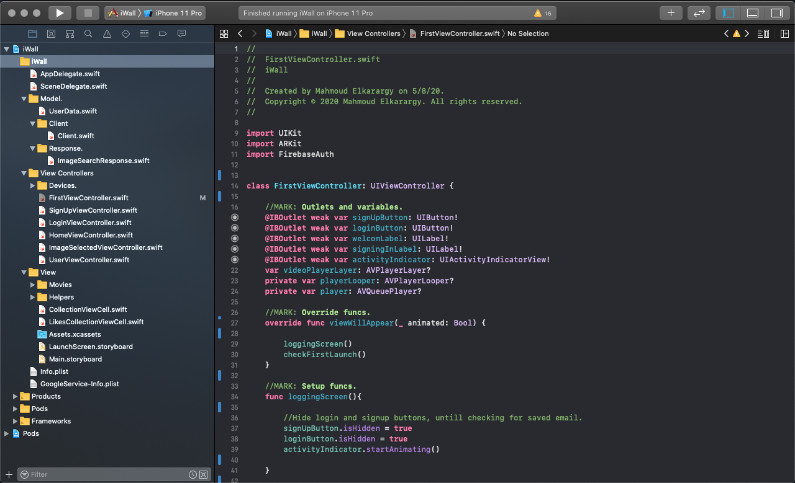
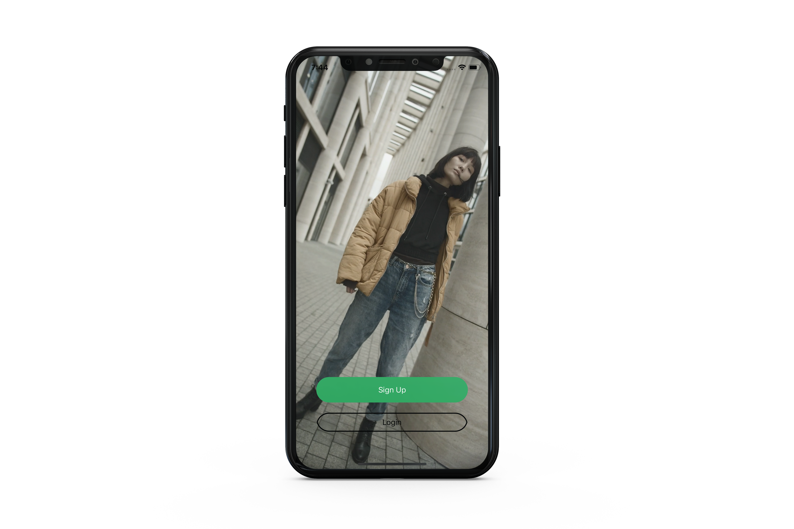
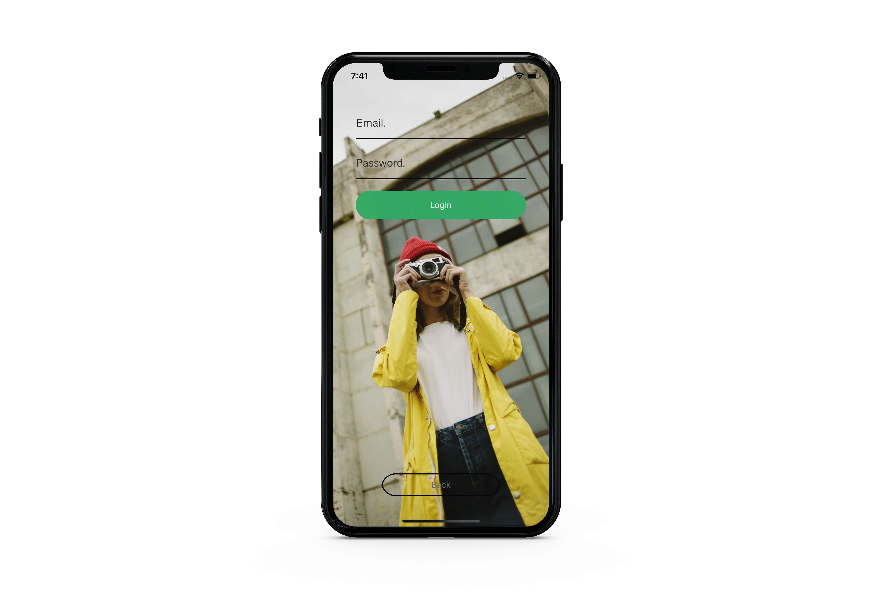
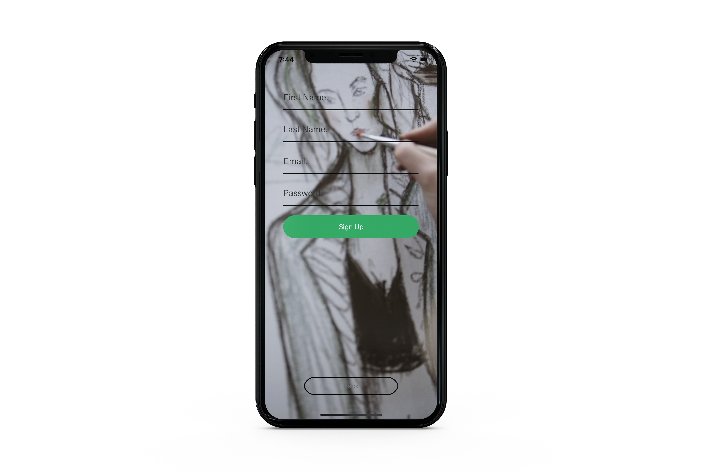
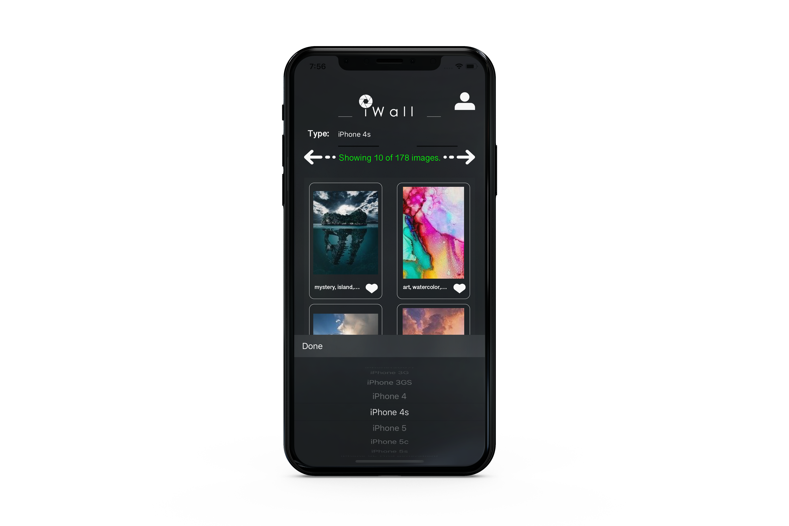
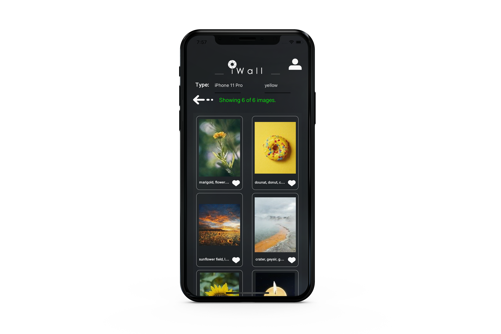
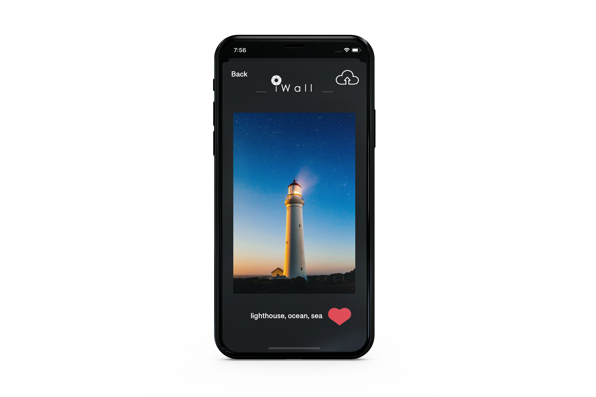
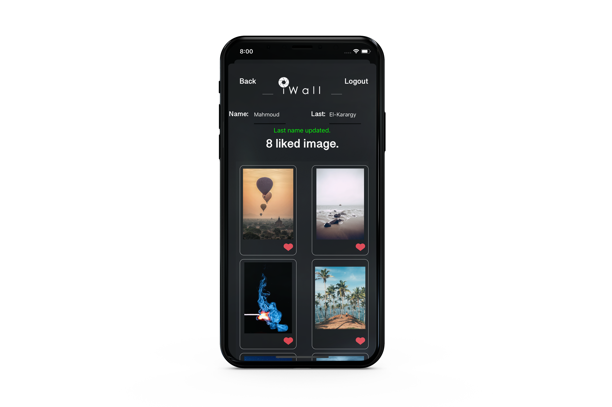
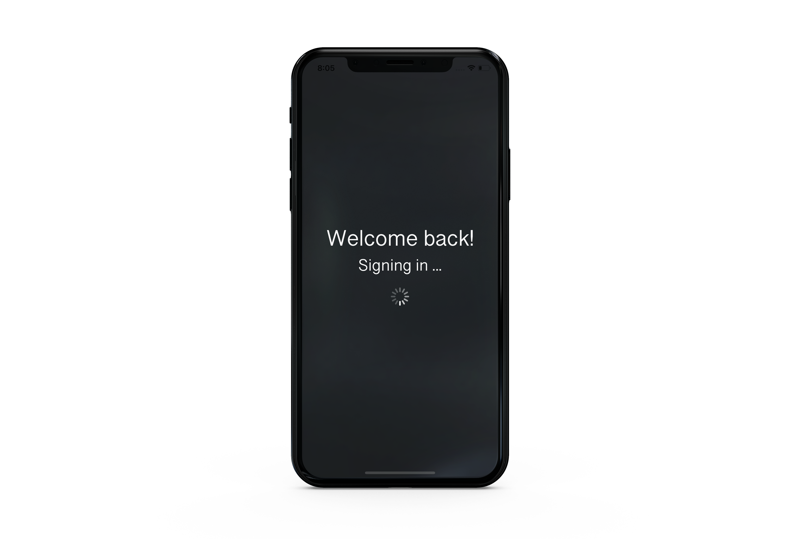

# iWall
(This is the final capstone project app for Udacity iOS Developer Nanodegree.

Beautify your iPhone screen with iWall.
An app that offers you hundreds of pictures for your device. Sign up now and download whatever you want. You can also add a photo to your like list and it will be saved. So, you could download or share it later.

iWall is an application that offers you a great variety of High-quality photos for your iPhone device. 
After signing up on the application, user selects his device and can easily search for specific collections.
Also, he can add photos to his like list, share a photo and save it!

## This project focused on:
* Design and build an app from the ground up.
* Build sophisticated and polished user interfaces with UIKit components.
* Downloading data from network resources.
* Using Firebase Framework for Authenticationa, Real-Time Database and Firebase Storage.
* Using NSCache to reduce the need to download reused data.

## App Structure
iWall is following the MVC pattern.

  

## Main Screen
- Allows the user to choose between Login or Sign Up. It’s animated with a background video.

  

## Login Screen
- Allows the user to log in using their Email and password. 
- Authenticate is done through Firebase Authenticate. 
- If the login does not succeed, an alert is presented specifying whether it was a failed network connection, or an incorrect Email and password. Also, It’s animated with a background video. 

  

## Sign up Screen
- Gives users the ability to sign up with Email and password, Pick his first and last name. 
- If the email is already regiestered with another account an alert is displayed.
- Email and password validation is added. Where password must be at least 6 charcters, contains a special character and a number. It’s also animated with a background video.

  

## Home Screen
### Device Select
- If it's the user first time to launch the App, He must select a device in order to perfourm search.
- If user already did a search before, He will found his device selected as it's stored in Firebase Database.

  

### Searching with tags
- User can easily search for specific images.

  

### Viewing image.
- By tapping an image, a new view appears containg the image in a Higher Quality and it's label.
- By tapping the like button (Heart), the user adds the image to his likes list.
- By tapping share button, The user will be able to share image and download it.

  

## Likes List Screen
- User can see all of his likes by tapping on the user icon.
- All liked images are stored in Firebase Storage. So, whenever a user login in any device anywhere he will found all his data saved and secured.
- Also, By tapping the like button again the image will be un-licked and will be removed from Firebase Storage.

  

### User info.
- User can also modify his first and last name using Firebase real time database.

  

## Persistent State.
- The App saves the user's data (email, password, device). So, when he re-launched the App this view will appear as it's automatically logging him to his account.
- The Main view won't appear as the user isn't asked to signin or signup, if there's a failed network connection the user will be re-moved to the Main View.
- After loggin, The User will be directed back to his Home view.
- Once oppening, the user data will be fetched from the Firebase database. So, the user will found his liked images and his name saved.

  

# Dependencies:
- Firebase Authentication.
- Firebase Realtime Database.
- Firebase Storage.
- Pixabay API.
- UIKit.
